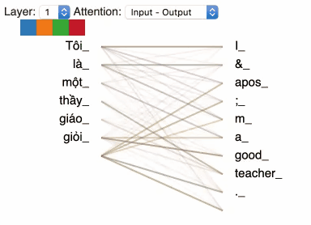

# Data augmentation with Back Translation. 

This repository builds on the idea of back translation as a data augmentation method. The idea is simple: translating a sentence in one language to another and then back to the original language. This way one can multiply the size of any NLP dataset. 

<p align="center">  </p>

We present demonstrations of how to use the code in this repository as well as some other free resources through a series of Google Colab. Initially we trained Vietnamese-English and English-Vietnamese models for back-translation. The code in this repository, however, can work with any other pair of languages. We therefore invite love, attention and **pull requests** from you on:

* More and/or better translation models.

* More and/or better translation data or monolingual data.

* Code to make our code even easier to use!

# Requirements

We make use of the `tensor2tensor` library to build deep neural networks that perform translation.

# Google Colaboratory Tutorials

We have prepared here a series of Google Colabs Notebooks to walk you through how to use our code in real contexts. You will be shown how to make use of free computational and free storage resources.

* [Interactive Back Translation](https://colab.research.google.com/github/vietai/back_translate/blob/master/colabs/Interactive_Back_Translation.ipynb): A minimal Colab for you to play with our final results. We use this colab to generate the GIF you saw above.

* [Training Translation Models](https://colab.research.google.com/github/vietai/back_translate/blob/master/colabs/T2T_translate_vi%3C_%3Een_tiny_tpu.ipynb): How to connect to GPU/TPU and Google Drive/Cloud storage, download training/testing data and train/evaluate your models.

* [Analyse your Translation Models](https://colab.research.google.com/github/vietai/back_translate/blob/master/colabs/Vietnamese_Backtranslation_Model_Analysis.ipynb): Play with and visualize the trained models attention.


<p align="center">  </p>

* [Use Translation Models to Augment An NLP Dataset](https://colab.research.google.com/github/vietai/back_translate/blob/master/colabs/Sentiment_Analysis_%2B_Back_translation.ipynb): See an example of how to augment a small NLP dataset in Vietnamese using your translation models and obtain real gains on test set.

Here is another GIF demo with a Vietnamese sentence, for fun:

<p align="center">  </p>


## BibTex

If you make use of code/resources provided in this project, please cite the following BibTex:

```
@article{trieu19backtranslate,
  author  = {Trieu H. Trinh and Thang Le and Phat Hoang and Minh{-}Thang Luong},
  title   = {Back Translation as Data Augmentation Tutorial},
  journal = {https://github.com/vietai/back_translate},
  year    = {2019},
}
```

The rest of this `README` is for those who cannot have access to our Colab Notebook and/or only need to see the syntax of some commands to run our code.

# Training the two translation models

A prerequisite to performing back-translation is to train two translation models: English to Vietnamese and Vietnamese to English. A demonstration of the following commands to generate data, train and evaluate the models can be found in [this Google Colab](https://colab.research.google.com/github/vietai/back_translate/blob/master/colabs/T2T_translate_vi%3C_%3Een_tiny_tpu.ipynb).

## Generate data (tfrecords)

For English -> Vietnamese

```
python t2t_datagen.py --data_dir=data/translate_envi_iwslt32k --tmp_dir=tmp/ --problem=translate_envi_iwslt32k
```

For Vietnamese -> English

```
python t2t_datagen.py --data_dir=data/translate_vien_iwslt32k --tmp_dir=tmp/ --problem=translate_vien_iwslt32k
```

## Train

Some examples to train your translation models with the Transformer architecture:

For English -> Vietnamese

```
python t2t_trainer.py --data_dir=path/to/tfrecords --problem=translate_envi_iwslt32k --hparams_set=transformer_base --model=transformer --output_dir=path/to/ckpt/dir
```

For Vietnamese -> English

```
python t2t_trainer.py --data_dir=path/to/tfrecords --problem=translate_vien_iwslt32k --hparams_set=transformer_base --model=transformer --output_dir=path/to/ckpt/dir
```

## Analyse the trained models

Once you finished training and evaluating the models, you can certainly play around with them a bit. For example, you might want to run some interactive translation and/or visualize the attention masks for your inputs of choice. This is demonstrated in [this Google Colab](https://colab.research.google.com/github/vietai/back_translate/blob/master/colabs/Vietnamese_Backtranslation_Model_Analysis.ipynb).

# Back translate from a text file.

We have trained two translation models (`vien` and `envi`) using the `tiny` setting of `tensor2tensor`'s Transformer, and put it on Google Cloud Storage with public access for you to use.

Here is an example of back translating Vietnamese -> English -> Vietnamese from an input text file.

```
python back_translate.py --lang=vi --decode_hparams="beam_size=4,alpha=0.6" --paraphrase_from_file=test_input.vi --paraphrase_to_file=test_output.vi --model=transformer --hparams_set=transformer_tiny
```

For a demonstration of augmenting real datasets with back-translation and obtaining actual gains in accuracy, checkout [this Google Colab](https://colab.research.google.com/github/vietai/back_translate/blob/master/colabs/Sentiment_Analysis_%2B_Back_translation.ipynb)!