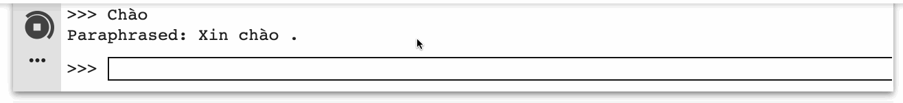

# :sparkles: Data Augmentation by Back-translation (DAB) :sparkles:

This repository builds on the idea of back translation [1] as a data augmentation method [2, 3]. The idea is simple: translating a sentence in one language to another and then back to the original language. This way one can multiply the size of any NLP dataset. An example using our code is shown below:

<p align="center">  </p>


In this project we provide a nice interface for people to investigate back-translation models interactively that works with any `tensor2tensor` checkpoints. We also provide the option to perform back-translation in batch mode for back-translating a full dataset, see [this section](https://github.com/vietai/dab#notebook-a-case-study-on-back-translation-for-low-resource-languages). Here we provide two sets of trained checkpoints:

* English - Vietnamese: [[en-vi]](https://console.cloud.google.com/storage/browser/vien-translation/checkpoints/translate_envi_iwslt32k_tiny/avg/) [[vi-en]](https://console.cloud.google.com/storage/browser/vien-translation/checkpoints/translate_vien_iwslt32k_tiny/avg/). See [Appendix A](https://github.com/vietai/dab#appendix-a-training-translation-models-with-tensor2tensor) for how to train and visualize your own translation models.

* English - French: [[en-fr]](https://console.cloud.google.com/storage/browser/vien-translation/checkpoints/translate_enfr_fren_uda/enfr/) [[fr-en]](https://console.cloud.google.com/storage/browser/vien-translation/checkpoints/translate_enfr_fren_uda/fren). This is taken from [github repository of UDA](https://github.com/google-research/uda).

## :notebook: Interactive Back-translation.

We use [this Colab Notebook](https://colab.research.google.com/github/vietai/dab/blob/master/colab/Interactive_Back_Translation.ipynb) to generate the GIF you saw above.

## :notebook: A Case Study on Back-translation for Low-resource Languages

Unsupervised Data Augmentation [3] has demonstrated improvements for high-resource languages (English) by back-translation. In this work, we conduct a case study for Vietnamese through the following [Colab Notebook](https://colab.research.google.com/github/vietai/dab/blob/master/colab/Sentiment_Analysis_%2B_Back_translation.ipynb). 

On a Sentiment Analysis dataset with only 10K examples, we use back-translation to double the training set size and obtain an improvement of near 2.5\% in absolute accuracy:


<table align="center">
<thead>
<tr>
<th>Original set</th>
<th>Augmented by Back Translation</th>
</tr>
</thead>
<tbody>
<tr>
<td>83.48 %</td>
<td><strong>85.91 %</strong></td>
</tr>
</tbody>
</table>


Here is another GIF demo with Vietnamese sentences - for fun ;)

<p align="center">  </p>

## How to contribute? :thinking:

:seedling: More and/or better translation models. Check out [Appendix A](https://github.com/vietai/dab#appendix-a-training-translation-models-with-tensor2tensor) for Colab Notebook tutorials on how to train translation models with `tensor2tensor`.

:seedling: More and/or better translation data or monolingual data.

:seedling: Code to make our code even easier to use - including tests ([Travis](https://github.com/marketplace/travis-ci), [CodeCov](https://github.com/codecov)).

:seedling: Texts/Illustrations to make our documentation even easier to understand.

We will be working on a more detailed guideline for contribution.

## BibTex :honeybee:

```
@article{trieu19backtranslate,
  author  = {Trieu H. Trinh and Thang Le and Phat Hoang and Minh{-}Thang Luong},
  title   = {A Tutorial on Data Augmentation by Backtranslation (DAB)},
  journal = {https://github.com/vietai/dab},
  year    = {2019},
}
```

## References

[1] Sennrich, Rico, Barry Haddow, and Alexandra Birch. "Improving neural machine translation models with monolingual data.", ACL 2016.

[2] Edunov, Sergey, et al. "Understanding back-translation at scale.",  EMNLP 2018.

[3] Xie, Qizhe, et al. "Unsupervised data augmentation." arXiv preprint arXiv:1904.12848 (2019).

[4] Clark, Kevin, et al. "Semi-supervised sequence modeling with cross-view training.", EMNLP 2018.

## Appendix A: Training Translation Models with `tensor2tensor`

:notebook: [Training Translation Models](https://colab.research.google.com/github/vietai/dab/blob/master/colab/T2T_translate_vi%3C_%3Een_tiny_tpu.ipynb): How to connect to GPU/TPU and Google Drive/Cloud storage, download training/testing data from the internet and train/evaluate your models. We use the IWSLT'15 dataset for the English-Vietnamese pair, off-the-shelf Transformer implementation from `tensor2tensor` with its `transformer_tiny` setting and obtain the following result:


<table align="center">
<thead>
<tr>
<th></th>
<th>BLEU score</th>
</tr>
</thead>
<tbody>
<tr>
<td>English to Vietnamese</td>
<td>28.7</td>
</tr>
<tr>
<td>Vietnamese to English</td>
<td>27.8</td>
</tr>
</tbody>
</table>


As of this writing, the result above is already competitive with the current state-of-the-art (29.6 BLEU score) [4], without using semi-supervised or multi-task learning. More importantly, this result is good enough to be useful for the purpose of this project! For English-French, we use the `transformer_big` provided in the [open-source implementation](https://github.com/google-research/uda) of Unsupervised Data Augmentation [3].

:notebook: [Analyse your Translation Models](https://colab.research.google.com/github/vietai/dab/blob/master/colab/Vietnamese_Backtranslation_Model_Analysis.ipynb): Play with and visualize the trained models attention.

<p align="center">  </p>


## Appendix B: Command Syntax

The remaining of this `README` is for those who cannot have access to our Colab Notebooks and/or only need a quick reference to the command syntax of our code.

### Requirements

We make use of the `tensor2tensor` library to build deep neural networks that perform translation.

### Training the two translation models

A prerequisite to performing back-translation is to train two translation models: English to Vietnamese and Vietnamese to English. A demonstration of the following commands to generate data, train and evaluate the models can be found in [this Google Colab](https://colab.research.google.com/github/vietai/dab/blob/master/colab/T2T_translate_vi%3C_%3Een_tiny_tpu.ipynb).

#### Generate data (tfrecords)

For English -> Vietnamese

```
python t2t_datagen.py \
--data_dir=data/translate_envi_iwslt32k \
--tmp_dir=tmp/ \
--problem=translate_envi_iwslt32k
```

For Vietnamese -> English

```
python t2t_datagen.py \
--data_dir=data/translate_vien_iwslt32k \
--tmp_dir=tmp/ \
--problem=translate_vien_iwslt32k
```

#### Train

Some examples to train your translation models with the Transformer architecture:

For English -> Vietnamese

```
python t2t_trainer.py \
--data_dir=data/translate_envi_iwslt32k \
--problem=translate_envi_iwslt32k \
--hparams_set=transformer_tiny \
--model=transformer \
--output_dir=checkpoints/envi
```

For Vietnamese -> English

```
python t2t_trainer.py \
--data_dir=data/translate_vien_iwslt32k \
--problem=translate_vien_iwslt32k \
--hparams_set=transformer_tiny \
--model=transformer \
--output_dir=checkpoints/vien
```

#### Analyse the trained models

Once you finished training and evaluating the models, you can certainly play around with them a bit. For example, you might want to run some interactive translation and/or visualize the attention masks for your inputs of choice. This is demonstrated in [this Google Colab](https://colab.research.google.com/github/vietai/dab/blob/master/colab/Vietnamese_Backtranslation_Model_Analysis.ipynb).

### Back translate from a text file.

We have trained two translation models (`vien` and `envi`) using the `tiny` setting of `tensor2tensor`'s Transformer, and put it on Google Cloud Storage with public access for you to use.

Here is an example of back translating Vietnamese -> English -> Vietnamese from an input text file.

```
python back_translate.py \
--decode_hparams="beam_size=4,alpha=0.6" \
--paraphrase_from_file=test_input.vi \
--paraphrase_to_file=test_output.vi \
--model=transformer \
--hparams_set=transformer_tiny \
--from_ckpt=checkpoints/vien \
--to_ckpt=checkpoints/envi \
--from_data_dir=data/translate_vien_iwslt32k \
--to_data_dir=data/translate_envi_iwslt32k
```

Add `--backtraslate_interactively` to back-translate interactively from your terminal. Alternatively, you can also check out [this Colab](https://colab.research.google.com/github/vietai/dab/blob/master/colabs/Interactive_Back_Translation.ipynb).

For a demonstration of augmenting real datasets by back-translation and obtaining actual gains in accuracy, check out [this Google Colab](https://colab.research.google.com/github/vietai/dab/blob/master/colab/Sentiment_Analysis_%2B_Back_translation.ipynb)!